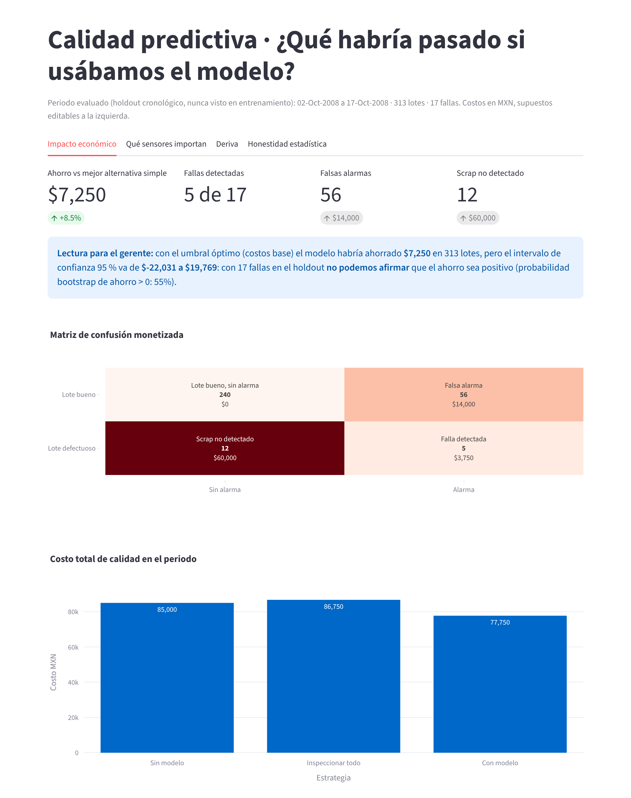
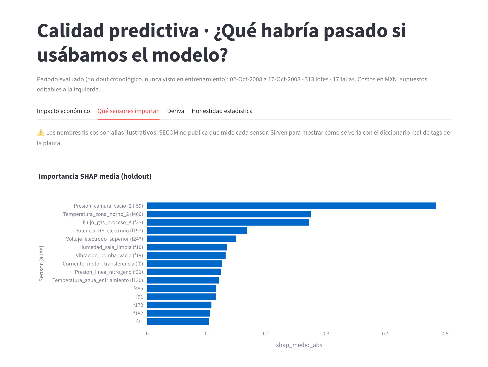
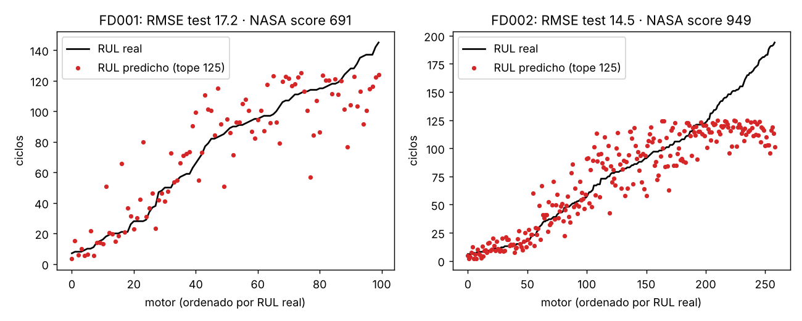

# Predictive Quality · MLOps

**Sistema de soporte a decisiones de calidad industrial, de punta a punta:** predice qué lotes de semiconductores (SECOM) tienen riesgo de falla, traduce el resultado a pesos ahorrados o gastados, lo expone como API y dashboard, y vigila su propia degradación. Incluye un módulo de mantenimiento predictivo (NASA C-MAPSS) con vida útil restante (RUL) y costo preventivo vs. correctivo.

> **Lo que este proyecto demuestra, y lo que no.** Con SECOM hay señal real pero débil: el modelo ordena los lotes mejor que el azar, pero el ahorro económico **no está estadísticamente demostrado** (IC95 % del ahorro: −22 k a +20 k MXN en 313 lotes). Se reporta así a propósito. Con C-MAPSS sí hay un beneficio claro. La contribución es el método, la validación sin fuga de información y la ingeniería, no una cifra inflada.



## 1. Problema de negocio
Un lote defectuoso que pasa sin detectarse cuesta mucho más que inspeccionar un lote bueno. Se usan estos costos (supuestos editables en `src/pqm/config.py` y en el dashboard; **no vienen de los datos**):

| Evento | Costo MXN |
|---|---|
| Scrap no detectado | 5,000 |
| Inspección de un lote marcado | 250 |
| Retrabajo de una falla detectada | 500 |

Se mide el éxito como **costo de la no calidad evitado frente a la mejor alternativa simple** (no hacer nada o inspeccionar todo), no con accuracy ni F1.

## 2. Resultados reales (SECOM, holdout cronológico)
1 567 lotes, 590 sensores, 104 fallas (6.6 %), jul–oct 2008. Entrenamiento: primeros 80 % del tiempo; holdout: último 20 % (313 lotes, 17 fallas), evaluado una sola vez.

| Métrica | Valor |
|---|---|
| PR-AUC holdout | **0.089** (IC95 % 0.043–0.197), prevalencia 0.054 |
| ROC-AUC holdout | 0.62 |
| Lift en el 10 % de mayor riesgo | 2.4× |
| Fallas detectadas / falsas alarmas | 5 de 17 / 56 |
| Ahorro vs. mejor alternativa simple | 7 250 MXN (+8.5 %), IC95 % −22 031 a +19 769; P(ahorro>0) = 55 % |

**Hallazgos que importan**
- **El split aleatorio infla el resultado.** Misma configuración: PR-AUC 0.154 con partición aleatoria vs. 0.09 con validación temporal (`reports/figures/fuga_vs_temporal.png`). La planta real es no estacionaria (la tasa de falla cambia por mes).
- **El ahorro depende de la razón de costos.** Solo es positivo en una banda intermedia (scrap ≈ 20–40× el costo de inspección); a razones de 5, 10 y 80 el modelo pierde frente a la alternativa simple.
- **Imputación:** KNN (0.094) ≈ mediana (0.089) ≈ sin imputar (0.088) en PR-AUC; las diferencias son menores que el intervalo de incertidumbre. Se usa KNN por criterio, no porque gane con claridad.
- **Deriva fuerte:** 142 de 273 sensores con PSI > 0.25 entre entrenamiento y holdout. Hace falta reentrenar y monitorear.

## 3. Explicabilidad (SHAP) y su límite
SHAP TreeExplainer global y por lote; la API devuelve los factores principales de cada predicción con dirección. `config/sensor_aliases.yaml` traduce algunos sensores a nombres de planta (p. ej. `f59 → Presion_camara_vacio_2`).

> **Esos nombres son hipotéticos.** SECOM publica los sensores de forma anónima; los alias son ilustrativos y muestran cómo quedaría con el diccionario de tags real de una planta. **No se afirma que el modelo haya aprendido la física del proceso**: al reentrenar con 80 % de los datos, solo ~52 % del top-10 de SHAP se mantiene, así que el ranking es una pista a investigar con ingeniería, no una causa raíz.



## 4. Mantenimiento predictivo: NASA C-MAPSS (FD001 y FD002)
RUL con tope de 125 ciclos, características de ventana deslizante (valor, media móvil y pendiente de degradación de 10 ciclos, solo con pasado), normalización por régimen operativo (KMeans, 6 regímenes en FD002), LightGBM, validación agrupada por motor, y evaluación en el **conjunto de prueba oficial** (último ciclo de cada motor frente al archivo RUL).

| | FD001 (1 régimen) | FD002 (6 regímenes) |
|---|---|---|
| RMSE test (RUL con tope) | 17.2 | 14.5 |
| NASA score | 691 | 949 |
| P(falla en ≤30 ciclos): PR-AUC test | 0.93 | 0.98 |
| Costo correr hasta fallar | 10 000 | 25 900 |
| Costo con política guiada por modelo | 2 095 | 5 394 |
| Mejor plazo fijo común (elegido mirando el test) | 2 346 | 6 253 |
| Fallas no evitadas | 1 de 100 | 0 de 259 |

Política: reemplazar cuando falten `margen` ciclos según la predicción; el margen (50) se elige solo con predicciones fuera de muestra del entrenamiento. Costos supuestos: correctivo 100, preventivo 15, 0.12 por ciclo de vida desperdiciado.

**Límites:** no se implementó Weibull ni Random Survival Forest; la probabilidad de falla viene de un clasificador sobre RUL ≤ 30 (sin calibrar formalmente). El RMSE se calcula contra la RUL con tope 125 (sin tope: 18.4 y 26.7). Los costos son supuestos. No se trabajó FD003/FD004 ni los datos de propulsión naval / hidráulicos.



## 5. Arquitectura
```
data/raw → pqm.data → SensorCleaner (fit solo en train: constantes, >50 % NaN, imputación, |r|>0.95)
        → LightGBM (scale_pos_weight, sin SMOTE) → umbral por costo (OOF temporal)
        → models/ + reports/ (MLflow sqlite) ─┬─ FastAPI  /predict /predicciones /drift /health /model-info
                                              └─ Streamlit (gerente de planta)
```
- `src/pqm/`: `data`, `features`, `models`, `evaluation`, `drift`, `explain`, `train`, `api/`, `rul/`.
- Registro de cada predicción en SQLite (`predicciones`); `/drift` calcula PSI contra una muestra de referencia con lo realmente recibido.
- CI (GitHub Actions): pytest + `docker build` + prueba de humo de la API en contenedor.

## 6. Cómo ejecutarlo
```bash
pip install -r requirements-dev.txt
make test        # 18 pruebas
make train       # ~2 min: entrena, evalúa, escribe models/ y reports/ (MLflow en mlflow.db)
make rul         # módulo C-MAPSS (~1 min)
make api         # http://localhost:8000/docs
make dashboard   # http://localhost:8501
docker compose up --build
```
Nota: la imagen Docker **no se construyó en el entorno de desarrollo** (sin daemon); se valida en el CI.

## 7. Limitaciones y decisiones
- Pocas fallas en el holdout (17): cualquier cifra económica tiene incertidumbre amplia.
- Costos ilustrativos; con costos reales el umbral y el ahorro cambian (ver sensibilidad).
- MLflow para experimentos; **DVC no se usó**: los datos públicos están versionados en el repo.
- Modelo de despliegue reentrenado con todos los lotes; su desempeño futuro no se mide aquí.

Datos: [UCI SECOM](https://archive.ics.uci.edu/dataset/179/secom) y [NASA C-MAPSS](https://data.nasa.gov/dataset/c-mapss-aircraft-engine-simulator-data), públicos, citados por sus fuentes. Detalle de pruebas de estrés y errores corregidos: [`docs/ERRORES_Y_PRUEBAS.md`](docs/ERRORES_Y_PRUEBAS.md).
