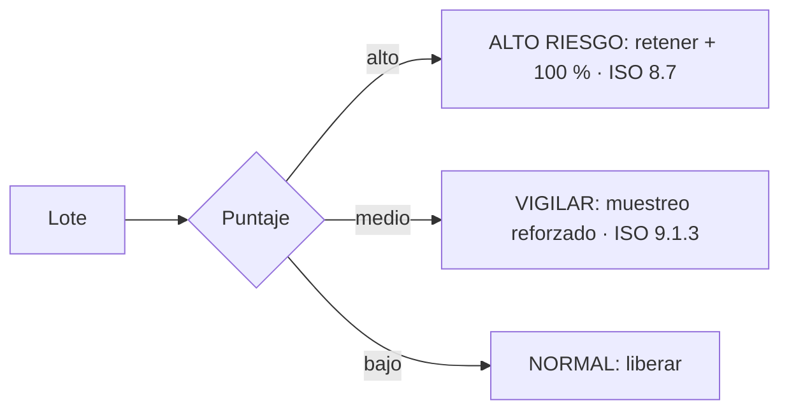
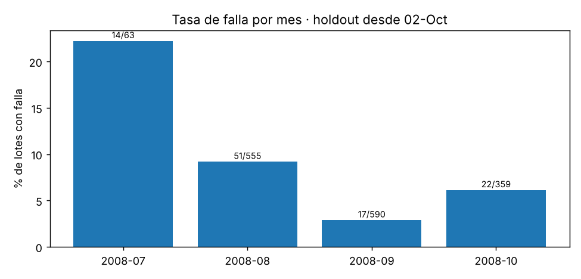
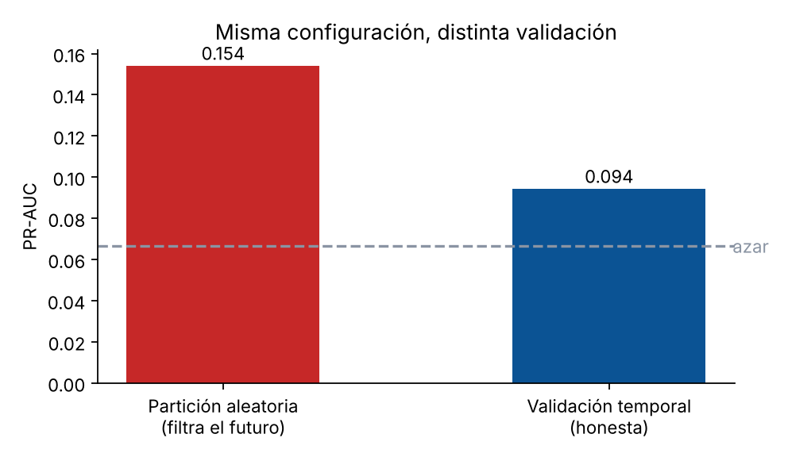
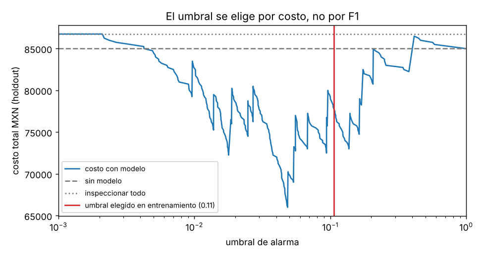
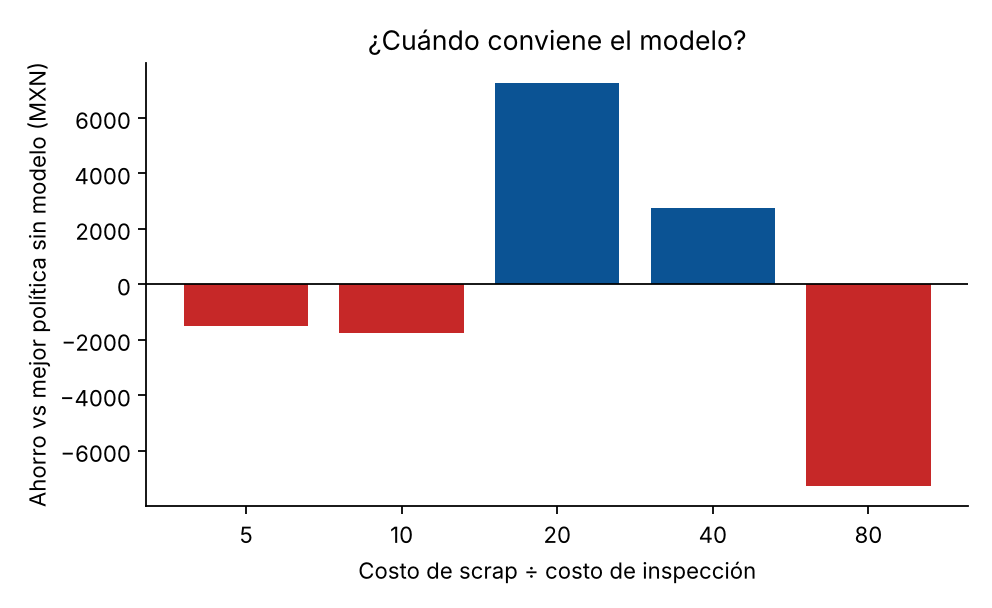
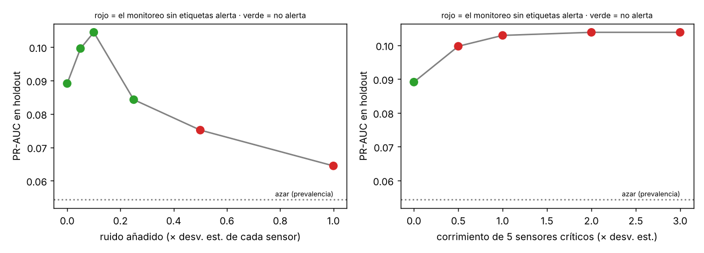
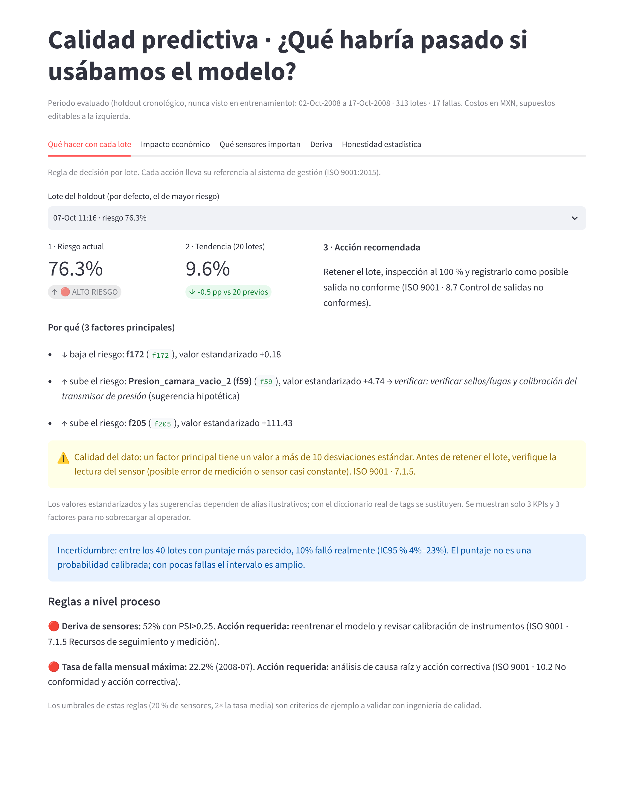

# Predictive Quality · MLOps

**Sistema de soporte a decisiones de calidad industrial, de punta a punta:** predice qué lotes de semiconductores (SECOM) tienen riesgo de falla, traduce el resultado a pesos ahorrados o gastados, lo expone como API y dashboard, y vigila su propia degradación. Incluye un módulo de mantenimiento predictivo (NASA C-MAPSS) con vida útil restante (RUL) y costo preventivo vs. correctivo.

## Resumen ejecutivo
Este sistema convierte datos de 590 sensores en una **decisión por lote** (liberar, vigilar, retener) con su acción y su referencia ISO 9001, mide el efecto en **costo de la no calidad (COPQ)** y avisa cuándo el modelo deja de ser confiable. El diferenciador no es el algoritmo: es la **taxonomía de decisión**, la **incertidumbre visible** y el **log de escrutinio** de lo que falló y se corrigió.

> **Lo que este proyecto demuestra, y lo que no.** Con SECOM hay señal real pero débil: el modelo ordena los lotes mejor que el azar, pero el ahorro económico **no está estadísticamente demostrado** (IC95 % del ahorro: −22 k a +20 k MXN en 313 lotes). Se reporta así a propósito. Con C-MAPSS sí hay un beneficio claro. La contribución es el método, la validación sin fuga de información y la ingeniería, no una cifra inflada.


## Taxonomía de decisión (ventaja competitiva)

El umbral sale de minimizar costo, no de maximizar F1; la banda intermedia existe porque el modelo es débil. Reglas de proceso: deriva en >20 % de sensores → reentrenar y revisar instrumentos (7.1.5); tasa mensual >2× la media → causa raíz (10.2). Detalle, familias de sensores y diccionario: [`docs/TAXONOMIA.md`](docs/TAXONOMIA.md). El dashboard muestra cada lote con su semáforo, la acción requerida y la tasa observada de falla en lotes parecidos con su intervalo (el puntaje **no** es una probabilidad calibrada).

## Desafíos y validación (log de escrutinio)
| Hipótesis inicial | Refutación | Corrección |
|---|---|---|
| El split aleatorio sirve para evaluar | PR-AUC 0.154 aleatorio vs 0.09 temporal: filtra lotes futuros | Ventanas expansivas + holdout cronológico único |
| El modelo ahorra dinero | IC95 % del ahorro incluye cero; negativo con razones de costo 5, 10 y 80 | Se publica la incertidumbre y la sensibilidad; se compara con la mejor alternativa simple |
| SHAP identifica causas del proceso | Solo ~52 % del top-10 se mantiene al reentrenar | Se retira la afirmación; los alias se marcan como hipotéticos |
| KNN es claramente mejor imputación | 0.094 vs 0.089 vs 0.088, dentro del ruido | Se declara empate práctico |
Más casos en [`docs/ERRORES_Y_PRUEBAS.md`](docs/ERRORES_Y_PRUEBAS.md).

## Decisiones de diseño
Cinco preguntas críticas de un sistema de calidad en producción, respondidas con la evidencia de este repositorio (incluye lo que no salió bien). Cifras reproducibles con `make train` y `make evidence`.

### 1. ¿Cómo garantizo que la validación no filtra información del futuro?
**Decisión.** Partición cronológica: entrenamiento = primeros 1 254 lotes (19-jul a 2-oct de 2008); holdout = últimos 313, evaluado **una sola vez**. Dentro del entrenamiento, ventanas expansivas (4 pliegues: se entrena con todo lo anterior y se prueba en el bloque siguiente). La limpieza de sensores (constantes, colinealidad, imputación KNN) y el umbral se ajustan **solo con el pasado de cada pliegue**.

**Evidencia.** El proceso no es estacionario: la tasa de falla pasó de 22 % en julio a 3 % en septiembre. Con partición aleatoria el mismo modelo "mejora" a PR-AUC 0.154 frente a 0.09 con la temporal: la diferencia es fuga.




**Límites.** Cada fila de SECOM es un lote distinto, así que agrupar por lote (GroupKFold) no añade protección aquí; sí lo haría con varias mediciones por lote (en C-MAPSS se agrupa por motor). No hay "embargo" entre entrenamiento y validación.

### 2. ¿Qué cuesta un falso negativo frente a un falso positivo y cómo lo incorporo?
**Decisión.** Sin SMOTE (altera la distribución física de los sensores): `scale_pos_weight` = 13.4 (negativos/positivos del entrenamiento). El umbral se elige **minimizando el costo esperado** con predicciones fuera de muestra del entrenamiento, no maximizando F1. Costos supuestos: scrap no detectado 5 000, inspección 250, retrabajo 500 MXN. Una falla detectada ahorra 4 250 MXN netos, o sea **paga 17 falsas alarmas**.

**Evidencia.** Curva de costo del holdout contra el umbral y sensibilidad a la razón de costos.




**Lo que sale mal.** El umbral elegido de antemano (0.106) cuesta 77 750 MXN en el holdout; con conocimiento del futuro el mejor umbral habría costado 66 000. Esa brecha es el precio de elegir sin ver el futuro y muestra que con 17 fallas el umbral es inestable. Además, a razones de costo scrap/inspección de 5, 10 y 80 el modelo pierde frente a la mejor alternativa simple.

### 3. ¿Cómo detecto que el modelo se degrada sin etiquetas?
**Decisión.** Dos señales que no necesitan ground truth, expuestas en `GET /drift` y alimentadas por el registro SQLite de cada predicción: (a) **PSI > 0.2 en más de 3 de los 10 sensores críticos** (top SHAP) y (b) **KS entre la distribución de puntajes de referencia y la reciente (p < 0.05)**. Alerta = reentrenar.

**Evidencia (prueba de estrés sobre el holdout).**

| Perturbación | PR-AUC | ¿Alerta? |
|---|---|---|
| Sin cambio | 0.089 | no |
| Ruido gaussiano 5 % / 10 % / 25 % de σ | 0.100 / 0.104 / 0.084 | no / no / no |
| Ruido 50 % de σ | 0.075 | **sí** (7 críticos con PSI>0.2) |
| Ruido 100 % de σ | 0.064 | **sí** |
| 5 sensores críticos desplazados ≥ 0.5 σ | ~0.10 | **sí** (KS p < 1e-19) |



**Lo que aprendí.** Con solo 60 lotes recientes el PSI dio una falsa alarma (4 críticos) sobre datos sin cambio: el PSI tiene sesgo de muestra pequeña. Por eso `/drift` exige al menos 100 predicciones. También: el PR-AUC con 17 fallas es ruidoso y no cae de forma monótona (sube con corrimientos pequeños), así que **la alerta de deriva no prueba degradación, solo avisa que el modelo opera fuera de lo que vio**; sobre el holdout real ya hay deriva en 142 de 273 sensores.

### 4. ¿Cuánto ahorra cada punto de recall?
**Decisión.** Tratar el recall como una decisión de costo, no de métrica. Con la prevalencia observada (5.4 %) hay ~54 fallas por cada 1 000 lotes: **cada punto de recall evita ~2 308 MXN brutos por 1 000 lotes**, siempre que no agregue más de ~9 falsas alarmas por punto.

**Evidencia (holdout, mejor costo posible por nivel de recall):**

| Fallas detectadas (recall) | Falsas alarmas | Costo MXN |
|---|---|---|
| 0 (0 %) | 0 | 85 000 |
| 5 (29 %) | 37 | 73 000 |
| 7 (41 %) | 69 | 72 500 |
| 9 (53 %) | 104 | 72 750 |
| 11 (65 %) | 111 | 66 000 |
| 12 (71 %) | 169 | 76 250 |
| 17 (100 %) | 266 | 79 250 |

**Lectura honesta.** El valor del recall **no es lineal**: tras 11 detecciones, una más exige 58 falsas alarmas adicionales (14 500 MXN) para evitar 4 250. Subir el recall "a 90 %" no ahorra por sí solo; depende de cuántas falsas alarmas cuesta. Estas cifras usan costos supuestos y 17 fallas.

### 5. ¿Qué hace el operador cuando el modelo alerta y cómo reduzco su carga cognitiva?
**Decisión.** La pantalla muestra solo **3 KPIs** (riesgo actual con semáforo, tendencia de 20 lotes y acción recomendada con su cláusula ISO 9001) y **3 factores** SHAP en lenguaje de planta, con una sugerencia de verificación. La API devuelve el mismo diagnóstico por lote (`factores`).



**Lo que encontré.** El lote de mayor riesgo del holdout (76 %) está dominado por un sensor con valor a +111 σ, probablemente un error de medición. Por eso el dashboard agrega una **guarda de calidad de dato**: si un factor principal pasa de 10 σ, pide verificar la lectura antes de retener el lote.

**Límites.** Los nombres y las sugerencias de verificación se derivan de alias hipotéticos; no se probó con operadores reales. Plan de adopción propuesto (no ejecutado): 30 días en modo sombra, comparar alertas contra la decisión del operador, sesión de 30 minutos centrada en "qué hacer con la alerta".

## 1. Problema de negocio
Un lote defectuoso que pasa sin detectarse cuesta mucho más que inspeccionar un lote bueno. Se usan estos costos (supuestos editables en `src/pqm/config.py` y en el dashboard; **no vienen de los datos**):

| Evento | Costo MXN |
|---|---|
| Scrap no detectado | 5,000 |
| Inspección de un lote marcado | 250 |
| Retrabajo de una falla detectada | 500 |

Se mide el éxito como **costo de la no calidad evitado frente a la mejor alternativa simple** (no hacer nada o inspeccionar todo), no con accuracy ni F1.

## 2. Resultados reales (SECOM, holdout cronológico)
1 567 lotes, 590 sensores, 104 fallas (6.6 %), jul–oct 2008. Entrenamiento: primeros 80 % del tiempo; holdout: último 20 % (313 lotes, 17 fallas), evaluado una sola vez.

| Métrica | Valor |
|---|---|
| PR-AUC holdout | **0.089** (IC95 % 0.043–0.197), prevalencia 0.054 |
| ROC-AUC holdout | 0.62 |
| Lift en el 10 % de mayor riesgo | 2.4× |
| Fallas detectadas / falsas alarmas | 5 de 17 / 56 |
| Ahorro vs. mejor alternativa simple | 7 250 MXN (+8.5 %), IC95 % −22 031 a +19 769; P(ahorro>0) = 55 % |

**Hallazgos que importan**
- **El split aleatorio infla el resultado.** Misma configuración: PR-AUC 0.154 con partición aleatoria vs. 0.09 con validación temporal (`reports/figures/fuga_vs_temporal.png`). La planta real es no estacionaria (la tasa de falla cambia por mes).
- **El ahorro depende de la razón de costos.** Solo es positivo en una banda intermedia (scrap ≈ 20–40× el costo de inspección); a razones de 5, 10 y 80 el modelo pierde frente a la alternativa simple.
- **Imputación:** KNN (0.094) ≈ mediana (0.089) ≈ sin imputar (0.088) en PR-AUC; las diferencias son menores que el intervalo de incertidumbre. Se usa KNN por criterio, no porque gane con claridad.
- **Deriva fuerte:** 142 de 273 sensores con PSI > 0.25 entre entrenamiento y holdout. Hace falta reentrenar y monitorear.

## 3. Explicabilidad (SHAP) y su límite
SHAP TreeExplainer global y por lote; la API devuelve los factores principales de cada predicción con dirección. `config/sensor_aliases.yaml` traduce algunos sensores a nombres de planta (p. ej. `f59 → Presion_camara_vacio_2`).

> **Esos nombres son hipotéticos.** SECOM publica los sensores de forma anónima; los alias son ilustrativos y muestran cómo quedaría con el diccionario de tags real de una planta. **No se afirma que el modelo haya aprendido la física del proceso**: al reentrenar con 80 % de los datos, solo ~52 % del top-10 de SHAP se mantiene, así que el ranking es una pista a investigar con ingeniería, no una causa raíz.


## 4. Mantenimiento predictivo: NASA C-MAPSS (FD001 y FD002)
RUL con tope de 125 ciclos, características de ventana deslizante (valor, media móvil y pendiente de degradación de 10 ciclos, solo con pasado), normalización por régimen operativo (KMeans, 6 regímenes en FD002), LightGBM, validación agrupada por motor, y evaluación en el **conjunto de prueba oficial** (último ciclo de cada motor frente al archivo RUL).

| | FD001 (1 régimen) | FD002 (6 regímenes) |
|---|---|---|
| RMSE test (RUL con tope) | 17.2 | 14.5 |
| NASA score | 691 | 949 |
| P(falla en ≤30 ciclos): PR-AUC test | 0.93 | 0.98 |
| Costo correr hasta fallar | 10 000 | 25 900 |
| Costo con política guiada por modelo | 2 095 | 5 394 |
| Mejor plazo fijo común (elegido mirando el test) | 2 346 | 6 253 |
| Fallas no evitadas | 1 de 100 | 0 de 259 |

Política: reemplazar cuando falten `margen` ciclos según la predicción; el margen (50) se elige solo con predicciones fuera de muestra del entrenamiento. Costos supuestos: correctivo 100, preventivo 15, 0.12 por ciclo de vida desperdiciado.

**Límites:** no se implementó Weibull ni Random Survival Forest; la probabilidad de falla viene de un clasificador sobre RUL ≤ 30 (sin calibrar formalmente). El RMSE se calcula contra la RUL con tope 125 (sin tope: 18.4 y 26.7). Los costos son supuestos. No se trabajó FD003/FD004 ni los datos de propulsión naval / hidráulicos.


## 5. Arquitectura
```
data/raw → pqm.data → SensorCleaner (fit solo en train: constantes, >50 % NaN, imputación, |r|>0.95)
        → LightGBM (scale_pos_weight, sin SMOTE) → umbral por costo (OOF temporal)
        → models/ + reports/ (MLflow sqlite) ─┬─ FastAPI  /predict /predicciones /drift /health /model-info
                                              └─ Streamlit (gerente de planta)
```
- `src/pqm/`: `data`, `features`, `models`, `evaluation`, `drift`, `explain`, `train`, `api/`, `rul/`.
- Registro de cada predicción en SQLite (`predicciones`); `/drift` calcula PSI contra una muestra de referencia con lo realmente recibido.
- CI (GitHub Actions): pytest + `docker build` + prueba de humo de la API en contenedor.

## 6. Cómo ejecutarlo
```bash
pip install -r requirements-dev.txt
make test        # 20 pruebas
make train       # ~2 min: entrena, evalúa, escribe models/ y reports/ (MLflow en mlflow.db)
make rul         # módulo C-MAPSS (~1 min)
make evidence    # costo vs umbral, estrés y explicaciones del holdout (~30 s)
make api         # http://localhost:8000/docs
make dashboard   # http://localhost:8501
docker compose up --build
```
Nota: la imagen Docker no se construyó en el entorno de desarrollo (sin daemon); el CI de GitHub la construye y hace una prueba de humo de `/health` en cada push (verde).

## 7. Limitaciones y decisiones
- Pocas fallas en el holdout (17): cualquier cifra económica tiene incertidumbre amplia.
- Costos ilustrativos; con costos reales el umbral y el ahorro cambian (ver sensibilidad).
- MLflow para experimentos; **DVC no se usó**: los datos públicos están versionados en el repo.
- Modelo de despliegue reentrenado con todos los lotes; su desempeño futuro no se mide aquí.

Datos: [UCI SECOM](https://archive.ics.uci.edu/dataset/179/secom) y [NASA C-MAPSS](https://data.nasa.gov/dataset/c-mapss-aircraft-engine-simulator-data), públicos, citados por sus fuentes. Detalle de pruebas de estrés y errores corregidos: [`docs/ERRORES_Y_PRUEBAS.md`](docs/ERRORES_Y_PRUEBAS.md).
