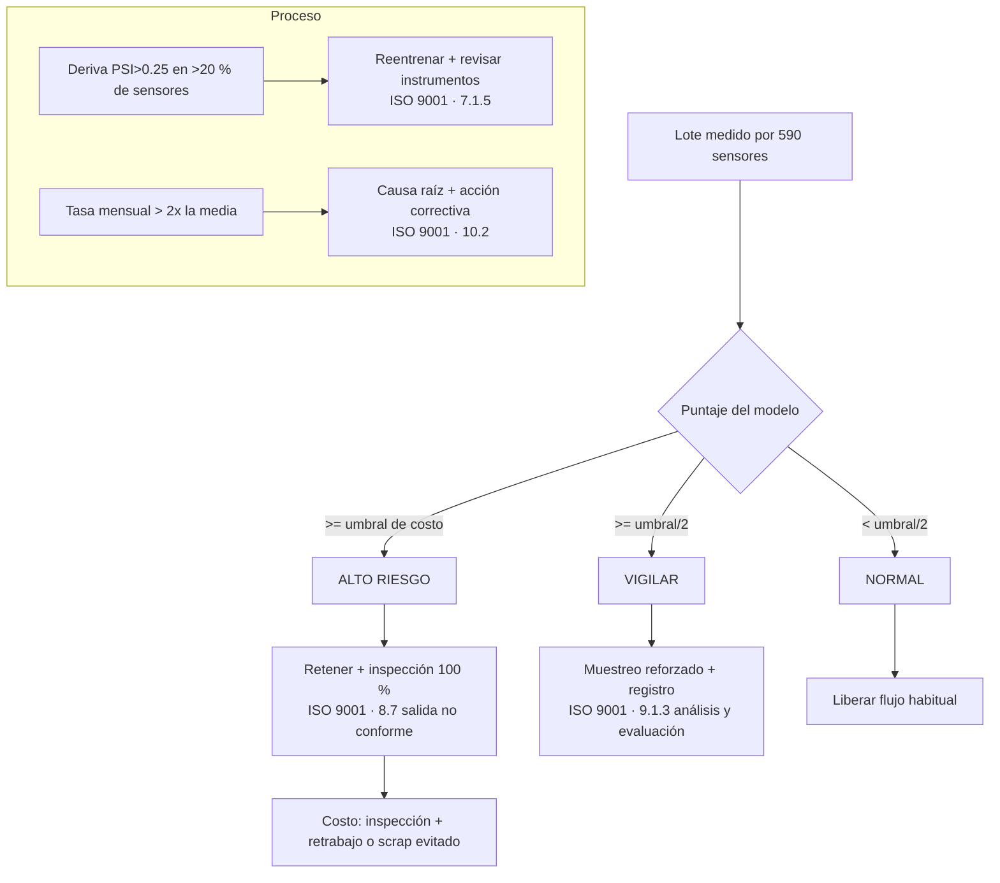
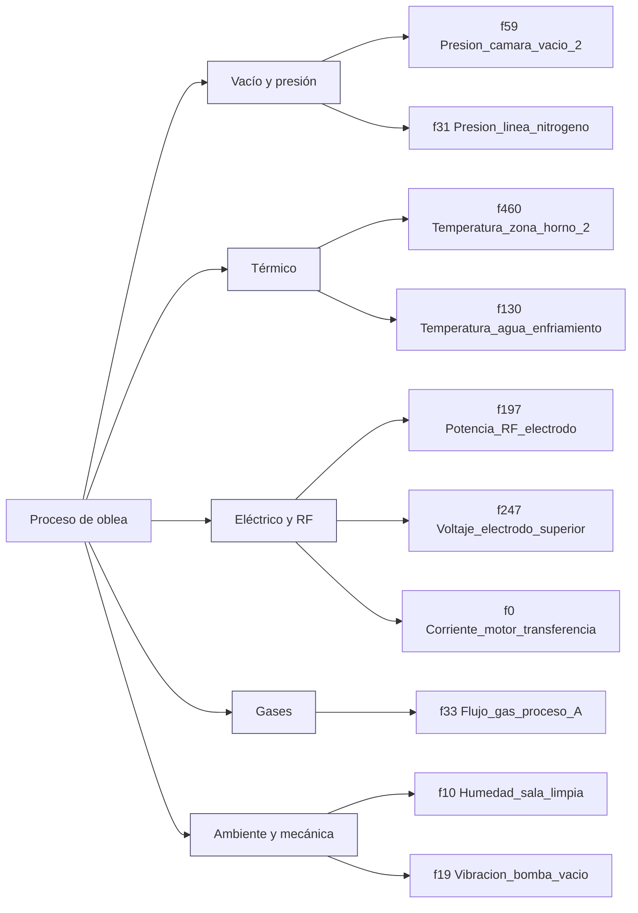

# Taxonomía de decisión y de sensores

SECOM no documenta qué mide cada sensor. La taxonomía de decisión es la contribución de diseño: convierte un puntaje de riesgo en una acción trazable a la norma.

## 1. Jerarquía de decisión (del dato a la acción)

**Por qué así:** el umbral de alarma sale de minimizar el costo (no de maximizar F1); la banda "vigilar" evita decisiones binarias donde el modelo es débil; las reglas de proceso protegen frente a la no estacionariedad observada.

## 2. Familias de sensores (hipotéticas)
Los alias de `config/sensor_aliases.yaml` se agrupan así para mostrar cómo se organizaría el diccionario real. **Son ilustrativos, no mediciones reales.**

## 3. Diccionario de datos
| Campo | Descripción |
|---|---|
| `f0..f589` | Sensores anónimos de SECOM (valores continuos, con faltantes) |
| `y` | 1 = lote falla (104), 0 = pasa (1 463) |
| `timestamp` | Fecha del lote (19-jul a 17-oct 2008); define el orden de validación |
| `p` | Puntaje del modelo (LightGBM con `scale_pos_weight`; **no calibrado**) |
| Costos | Supuestos editables, no provienen de los datos |
C-MAPSS: `motor, ciclo, op1-3, s1..s21`; RUL = ciclos hasta la falla (tope 125 en entrenamiento).
